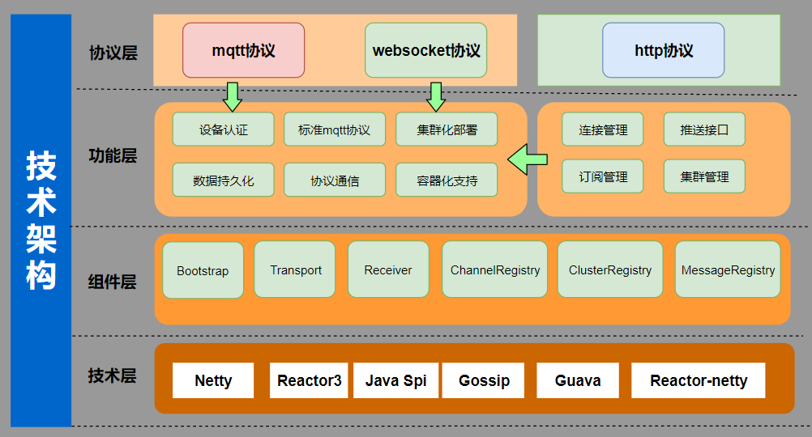
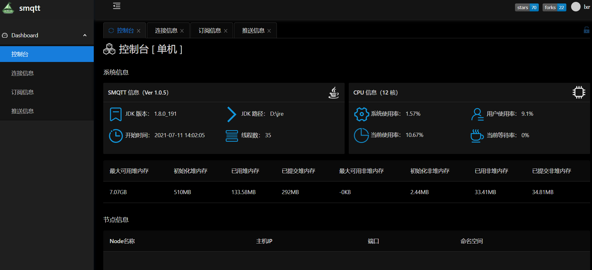
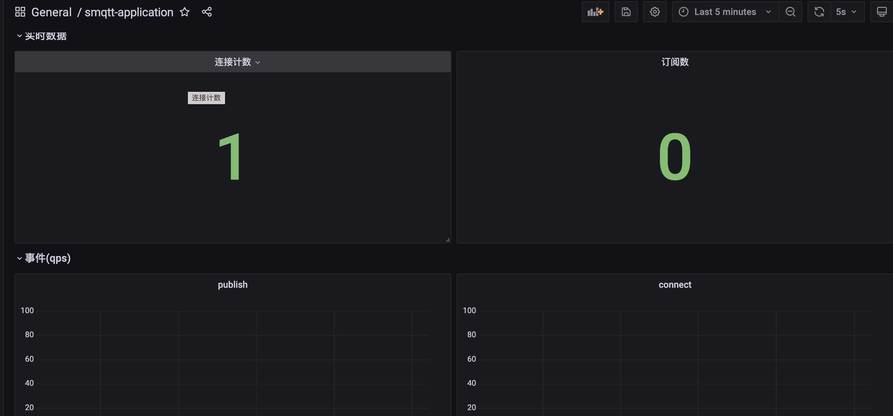
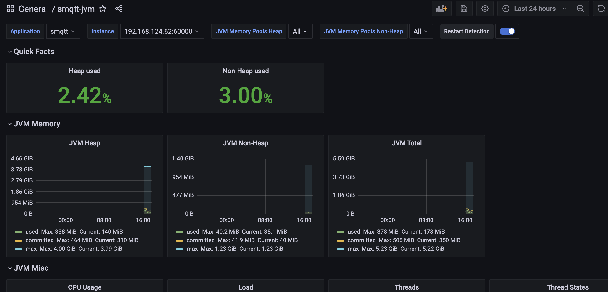
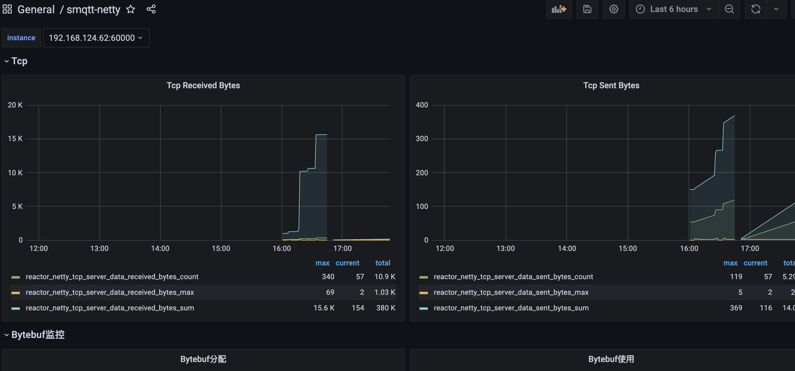

##  SMQTT开源的MQTT消息代理Broker

SMQTT基于reactor-netty(spring-webflux底层依赖)开发，底层采用Reactor3反应堆模型,支持单机部署，支持容器化部署，具备低延迟，高吞吐量，支持百万TCP连接，同时支持多种协议交互，是一款非常优秀的消息中间件！

## smqtt目前拥有的功能如下：



1. 消息质量等级实现(支持qos0，qos1，qos2)
2. topicFilter支持
    - topic分级（test/test）
    - +支持（单层匹配）
    - #支持（多层匹配）
3. 会话消息
    - 默认内存存储
    - 支持持久化（redis/db）
4. 保留消息
     - 默认内存存储
     - 支持持久化（redis/db）
5. 遗嘱消息
     > 设备掉线时候触发
6. 客户端认证
     - 支持spi注入外部认证
7. tls加密
     - 支持tls加密（mqtt端口/http端口）
8. websocket协议支持x
     > 使用mqtt over websocket
9. http协议交互
    - 支持http接口推送消息
    - 支持spi扩展http接口
10. SPI接口扩展支持
     - 消息管理接口（会话消息/保留消息管理）
     - 通道管理接口 (管理系统的客户端连接)
     - 认证接口 （用于自定义外部认证）
     - 拦截器  （用户自定义拦截消息）
11. 集群支持（gossip协议实现）
12. 容器化支持 
    > 默认镜像最新tag: 1ssqq1lxr/smqtt
13. 持久化支持（session 保留消息）
14. 规则引擎支持
15. 支持springboot starter启动
16. 管理后台
    > 请参考smqtt文档如何启动管理后台
17. grafana监控集成
    - 支持influxdb
    - 支持prometheus
    
## 尝试一下

> 大家不要恶意链接，谢谢！

| 管理                                     | 说明  | 其他  |
|----------------------------------------| ----  |----  |
| 113.90.145.99:18886                    | mqtt端口 |用户名：smqtt 密码：smqtt |
| 113.90.145.99:18888                    | mqtt over websocket |用户名：smqtt 密码：smqtt  |
| http://113.90.145.99:18887/smqtt/admin | 管理后台 |用户名：smqtt 密码：smqtt  |

## 启动方式

### main方式启动

引入依赖
```markdown
<!--smqtt依赖 -->
<dependency>
  <groupId>io.github.quickmsg</groupId>
  <artifactId>smqtt-core</artifactId>
  <version>${Latest version}</version>
</dependency>
<!--集群依赖 -->
<dependency>
   <artifactId>smqtt-registry-scube</artifactId>
   <groupId>io.github.quickmsg</groupId>
   <version>${Latest version}</version>
</dependency>
<!--管理ui依赖 -->
<dependency>
   <artifactId>smqtt-ui</artifactId>
   <groupId>io.github.quickmsg</groupId>
   <version>${Latest version}</version>
</dependency>
```

- 阻塞式启动服务：

```markdown
  Bootstrap bootstrap = Bootstrap.builder()
                .rootLevel(Level.DEBUG)
                .tcpConfig(
                        BootstrapConfig
                                .TcpConfig
                                .builder()
                                .port(8888)
                                .username("smqtt")
                                .password("smqtt")
                                .build())
                .httpConfig(
                        BootstrapConfig
                                .HttpConfig
                                .builder()
                                .enable(true)
                                .accessLog(true)
                                .build())
                .clusterConfig(
                        BootstrapConfig.
                                ClusterConfig
                                .builder()
                                .enable(true)
                                .namespace("smqtt")
                                .node("node-1")
                                .port(7773)
                                .url("127.0.0.1:7771,127.0.0.1:7772").
                                build())
                .build()
                .startAwait();
```

- 非阻塞式启动服务：

```markdown

  Bootstrap bootstrap = Bootstrap.builder()
                .rootLevel(Level.DEBUG)
                .tcpConfig(
                        BootstrapConfig
                                .TcpConfig
                                .builder()
                                .port(8888)
                                .username("smqtt")
                                .password("smqtt")
                                .build())
                .httpConfig(
                        BootstrapConfig
                                .HttpConfig
                                .builder()
                                .enable(true)
                                .accessLog(true)
                                .build())
                .clusterConfig(
                        BootstrapConfig.
                                ClusterConfig
                                .builder()
                                .enable(true)
                                .namespace("smqtt")
                                .node("node-1")
                                .port(7773)
                                .url("127.0.0.1:7771,127.0.0.1:7772").
                                build())
                .build()
                .start().block();
```

### jar方式

1. 下载源码 mvn compile package -Dmaven.test.skip=true -P jar,web

```markdown
  在smqtt-bootstrap/target目录下生成jar
```

2. 准备配置文件 config.yaml

   [config.yaml](config/config.yaml)

3. 启动服务

```markdown
  java -jar smqtt-bootstrap-1.0.1-SNAPSHOT.jar <config.yaml路径>
```


### docker 方式


拉取镜像

``` 
# 拉取docker镜像地址
docker pull 1ssqq1lxr/smqtt:latest
```

启动镜像默认配置

``` 
# 启动服务
docker run -it  -p 1883:1883 1ssqq1lxr/smqtt
```

启动镜像使用自定义配置（同上准备配置文件config.yaml）


``` 
# 启动服务
docker run -it  -v <配置文件路径目录>:/conf -p 1883:1883  -p 1999:1999 1ssqq1lxr/smqtt
```


### springboot方式

1. 引入依赖
   
    ```markdown
    <dependency>
        <groupId>io.github.quickmsg</groupId>
        <artifactId>smqtt-spring-boot-starter</artifactId>
        <version>${Latest version >= 1.0.8}</version>
    </dependency>
    ```

2. 启动类Application上添加注解 `  @EnableMqttServer`

3. 配置application.yml文件
     > properties也支持，但是需要自己转换，没有提供demo文件 

   [config.yaml](config/config.yaml)

4. 启动springboot服务服务即可
5. 如果引入的是spring-boot-starter-parent的管理包，如果启动报错，则需要添加以下依赖
```xml
      <dependency>
            <groupId>io.projectreactor</groupId>
            <artifactId>reactor-core</artifactId>
            <version>3.4.9</version>
        </dependency>
        <dependency>
            <groupId>io.projectreactor.netty</groupId>
            <artifactId>reactor-netty</artifactId>
            <version>1.0.10</version>
        </dependency>
```

## 官网地址

[smqtt官网](https://www.smqtt.cc/)

## wiki地址

[wiki地址](https://wiki.smqtt.cc/)


## 管理后台



## 监控页面

### Mqtt监控



### Jvm监控


### Netty监控



## License

[Apache License, Version 2.0](LICENSE)


## 友情链接
[一款非常好用的IOT平台：thinglinks](https://github.com/mqttsnet/thinglinks)


## 相关技术文档
- [reactor3](https://projectreactor.io/docs/core/release/reference/)
- [reactor-netty](https://projectreactor.io/docs/netty/1.0.12/reference/index.html)

## 麻烦关注下公众号！


- 添加微信号`Lemon877164954`，拉入smqtt官方交流群
- 加入qq群 `700152283` 


