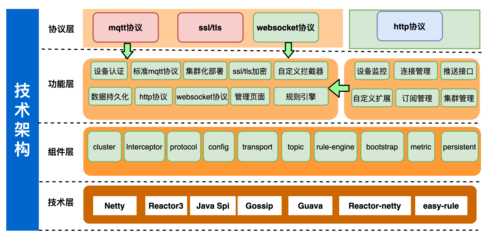

#  SMQTT 1.0.8文档

SMQTT基于Netty开发，底层采用Reactor3反应堆模型,支持单机部署，支持容器化部署，具备低延迟，高吞吐量，支持百万TCP连接，同时支持多种协议交互，是一款非常优秀的消息中间件！

## 架构图

## smqtt目前拥有的功能如下：

1.  消息质量等级实现(支持qos0，qos1，qos2)
2.  topicFilter支持
    - topic分级（test/test）
    - +支持（单层匹配）
    - #支持（多层匹配）
2.  会话消息
    - 默认内存存储
    - 支持持久化（redis/db）
3.  保留消息
     - 默认内存存储
     - 支持持久化（redis/db）
4.  遗嘱消息
     > 设备掉线时候触发
5.  客户端认证
     - 支持spi注入外部认证
6.  tls加密
     - 支持tls加密（mqtt端口/http端口）
7.  websocket协议支持x
     > 使用websocket协议包装mqtt协议
8.  http协议交互
    - 支持http接口推送消息
    - 支持spi扩展http接口
9.  SPI接口扩展支持
    - 消息管理接口（会话消息/保留消息管理）
    - 通道管理接口 (管理系统的客户端连接)
    - 认证接口 （用于自定义外部认证）
    - 拦截器  （用户自定义拦截消息）
10. 集群支持（gossip协议实现）
11. 容器化支持 
    > 默认镜像最新tag: 1ssqq1lxr/smqtt
12. 持久化支持（session 保留消息）
13. 规则引擎支持(文档需要赞助提供)
14. 支持springboot starter容器化
15. 管理后台
    > 请参考smqtt文档如何启动管理后台

## 尝试一下

> 大家不要恶意链接，谢谢！

|  管理   | 说明  | 其他  |
|  ----  | ----  |----  |
| 123.57.69.210:1883  | mqtt端口 |用户名：smqtt 密码：smqtt |
| 123.57.69.210:8999  | mqtt over websocket |用户名：smqtt 密码：smqtt  |
| http://123.57.69.210:60000/smqtt/admin | 管理后台 |用户名：smqtt 密码：smqtt  |

## 商业合作

> 添加微信号`Lemon877164954`

## 麻烦关注下公众号！

- 添加微信号`Lemon877164954`拉入smqtt官方交流群
- 加入qq群 `700152283` 