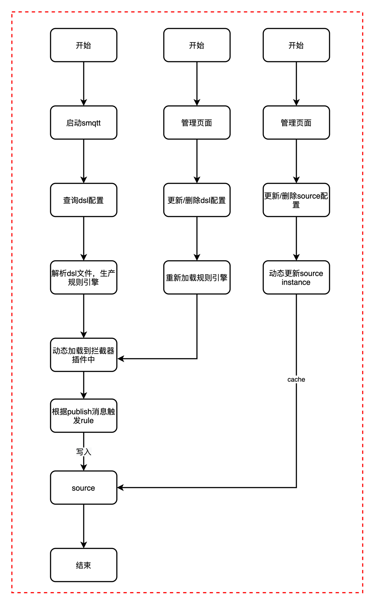

# 规则引擎设计概念


## 技术架构

### 模块设计

|  模块   | 依赖  | 说明  |
|  ----  | ----  |----  |
| smqtt-rule-engine  | jexl3 |执行规则引擎核心api |
| smqtt-dsl  | client id |用于解析规则引擎  |
| smqtt-source  | 各种数据源依赖配置 |外部数据源 |

### 架构图



1. 支持jexl3语法脚本
2. 支持多种规则节点
3. 支持动态Jexl脚本参数构建


## 规则引擎

### 规则引擎支持节点
- TOPIC 用于集群见转发
- PREDICATE 用于过滤节点
- LOG 用于打印日志
- KAFKA 用于发送到外部kafka
- ROCKET_MQ 用于发送到外部rocketmq
- HTTP 用于发送到外部http接口
- 其他暂未实现

### 规则引擎内置变量

  |  参数   | 说明  | 必传  |
  |  ----  | ----  |----  |
  | timestamp  | 消息时间 |是 |
  | clientIdentifier  | client id |是  |
  | topic  | topic |是 |
  | qos  | qos服务等级 | 是 |
  | retain  | 是否保留消息 | 是 |
  | msg  | 消息body | 是 |


### Jexl3 语法详解

- 支持java方法调用
    
   1. 过滤qos为1并且topic为test/test
   ```markdown
      qos == 1 && topic.equals("test/test")
   ```
   2. body如果是json，过滤某个属性值
  ```markdown
     msg.属性 == 值
  ```
   3. 支持模板替换，构建自定义json
   ```markdown
     '{"topic":"${topic}","msg":"${msg.test}","qos":${qos}}'
   ```
 
- jexl3官方文档

   - [JAVA DOC](http://commons.apache.org/proper/commons-jexl/apidocs/org/apache/commons/jexl3/package-summary.html)
   - [HOME DOC](http://commons.apache.org/proper/commons-jexl/reference/syntax.html)

    